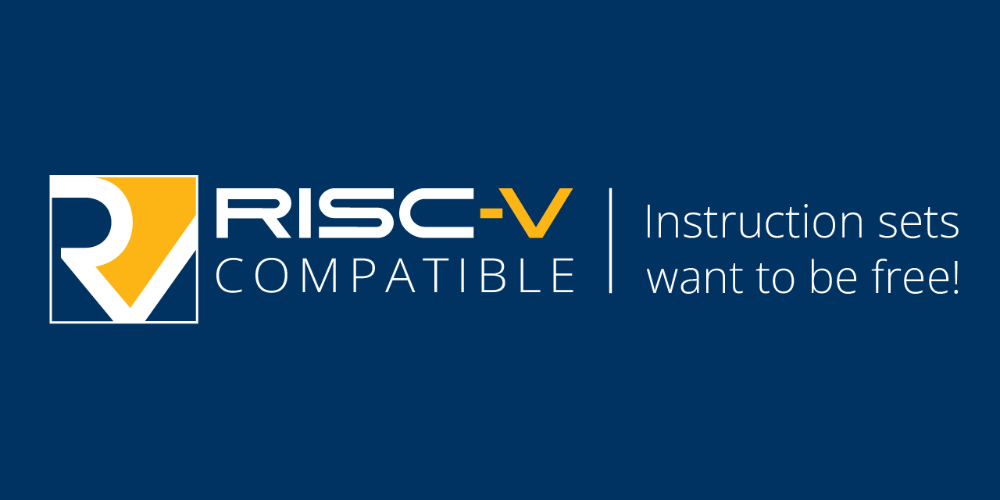

<h1>
  
  The Fifth Amendment of the RISC Constitution
</h1>

Ahoy, i’m a scallywag who thought it was a good idea to name myself RISC-V* and now i build software. Arr, Welcome aboard me Ol' GitHub! 🏴‍☠️💀

<h1>Projects</h1>
<a href="https://www.ecosia.org/"><code>>= Coming soon!</code></a>
 
<a href="https://www.ecosia.org/"><code>>= Coming soon!</code></a>
 
<a href="https://www.ecosia.org/"><code>>= Coming soon!</code></a>
 
<a href="https://www.ecosia.org/"><code>>= Coming soon!</code></a>
 

<h1>Friends & Personal Recommendations:</h1>

    <table>
        <tr>
            <td></td>
			<td></td>
            <td></td>
			<td></td>
			<td></td>
			<td></td>
			<td></td>
		</tr>
    </table>

  

<h6>
  * This account is fan-made and not affiliated with the RISC-V organization.  
  Check out their official development at:  
  GitHub: <a href="https://github.com/riscfive">riscfive</a> 
  Twitter (X): <a href="https://x.com/risc_v">@risc_v</a> 
  LinkedIn: <a href="https://ch.linkedin.com/company/risc-v-international">RISC-V International</a> 
  YouTube: <a href="https://www.youtube.com/channel/UC5gLmcFuvdGbajs4VL-WU3g">@RISCVInternational</a>
</h6>
